<p align="center">
  <picture>
    <source media="(prefers-color-scheme: dark)" srcset="assets/motion/hero-dark.gif">
    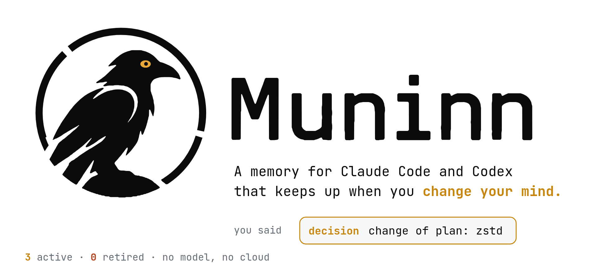
  </picture>
</p>

<p align="center">
  <a href="https://github.com/ilien-dev/muninn/actions/workflows/ci.yml"></a>
  
  
  
  <a href="LICENSE"></a>
</p>

# Muninn: persistent memory for Claude Code and Codex

**A memory for Claude Code and Codex that keeps up when you change your mind.**

Every time you open a new session, Claude Code or Codex starts from zero, with no idea that last
week you picked a database, agreed on a folder structure, or told it never to touch a certain
file. So you explain it all again, or it guesses.

Memory tools fix the forgetting, but most of them bring a new problem. They remember
*everything*, including the decisions you have since changed. Ask about the database and the
assistant gets the old choice and the new one side by side, and has to guess which is current.
Sometimes it guesses wrong, and you find the old choice back in your code.

Muninn remembers what you decided, and when you change your mind, it puts the old decision away.
The assistant only sees what is true now. The old one is still in your history if you ever want
to look.

It also turns the rules in your `CLAUDE.md` or `AGENTS.md` into settings that block the action,
so "never edit the migrations folder" holds even when the assistant has forgotten it. It runs on
your computer, with no cloud service and no API key.

<p align="center">
  <a href="#install"><b>Install</b></a> ·
  <a href="#what-happens-in-the-background">How it works</a> ·
  <a href="#rules-that-block-instead-of-rules-that-get-ignored">Rules</a> ·
  <a href="#muninn-compared-with-claude-mem-and-agentmemory">Compare</a> ·
  <a href="#questions">Questions</a> ·
  <a href="docs/technical-overview.md">Technical overview</a>
</p>

## A quick example

On Monday you tell the assistant:

> Let's use gzip to compress the files we send.

On Thursday you change your mind:

> Change of plan, let's use zstd instead.

Two weeks later, in a brand-new session, you ask it to write up how the project compresses
files. The assistant remembers neither conversation, so it checks its memory. A typical memory
tool hands it both messages. Muninn hands it only Thursday's, and the assistant writes zstd.

<p align="center">
  <picture>
    <source media="(prefers-color-scheme: dark)" srcset="assets/motion/change-dark.gif">
    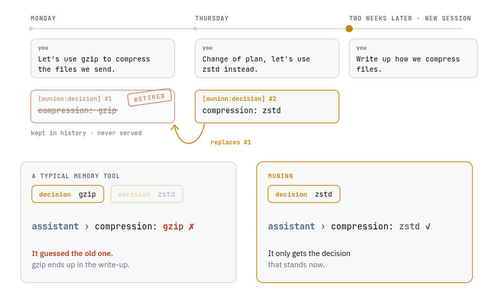
  </picture>
</p>

## Test results

We tested it against two popular memory tools, claude-mem and agentmemory. Every tool got the
same conversations, and the assistant was then given tasks that depended on a decision that had
later been changed.

<p align="center">
  <picture>
    <source media="(prefers-color-scheme: dark)" srcset="assets/motion/results-dark.gif">
    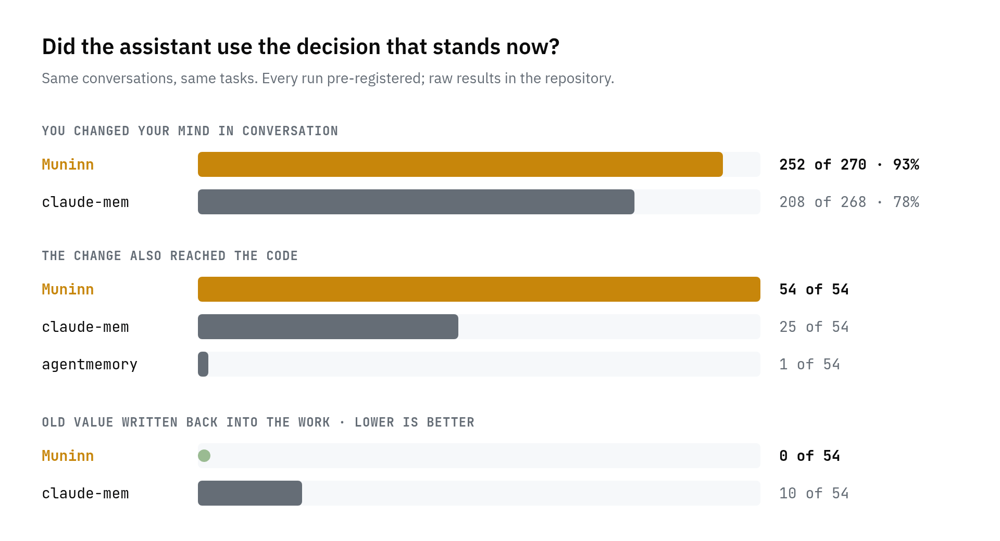
  </picture>
</p>

- **When you change your mind in conversation**, the assistant used the up-to-date decision in
  **252 of 270 tasks (93%)** with Muninn, against **208 of 268 (78%)** with claude-mem. We tried
  five different ways of phrasing the change, and Muninn was never behind.
- **When the change also shows up in your code**, the assistant got it right in **54 of 54**
  tasks with Muninn, 25 of 54 with claude-mem and 1 of 54 with agentmemory.
- **An old decision never sneaks back in.** With Muninn the assistant wrote a replaced value into
  its work 0 times out of 54. With claude-mem it did 10 times.

An early measurement also points to lower costs: on those same tasks the assistant took about
half as many steps with Muninn, and each task cost about 40% less. That figure has not been
confirmed by a test of its own yet, so read it as a first sign.

Each test had its rules written down before it ran, and all the raw results are in this
repository, so anyone can check them. The full comparison, including the tools we have not
tested yet, is in [docs/why-muninn.md](docs/why-muninn.md).

## What happens in the background

You never call Muninn. It rides along on the hooks Claude Code and Codex already fire, reads from
a small database in your project, and writes to it only when a session ends.

<p align="center">
  <picture>
    <source media="(prefers-color-scheme: dark)" srcset="assets/motion/flow-dark.gif">
    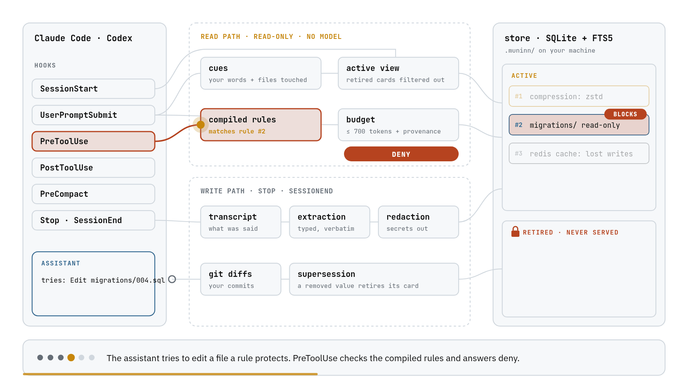
  </picture>
</p>

1. **A session starts.** The assistant gets a short catalog of what is on record, so it knows
   what it can ask for.
2. **You write a message.** Muninn takes your words and the files in play and looks for them among
   the decisions that still stand. Retired ones are not in the list it searches.
3. **The matches go back as evidence**, capped at 700 tokens, each with where it came from and how
   much to trust it. No AI model runs in this step, so the same question gets the same answer.
4. **The assistant reaches for something a rule forbids.** If you turned that rule into a setting,
   the tool refuses before anything changes.
5. **The session ends.** Muninn reads the conversation and keeps the decisions, rules, corrections
   and dead ends, in your words.
6. **A commit changes a value.** When the code stops using something a decision named, that
   decision is retired, and the new value is recorded along with the commit.

## What else it does

Once it is set up it works in the background, and you keep talking to your assistant as usual.
It keeps what you actually said rather than a summary of it, so nothing gets rewritten into
something you never meant. Everything stays on your computer: Muninn has no account and no cloud
service, and it never sends your conversations anywhere. It adds a few thousandths of a second
to each message.

<table>
  <tr>
    <td width="50%" valign="top">
      <picture>
        <source media="(prefers-color-scheme: dark)" srcset="assets/motion/catalog-dark.gif">
        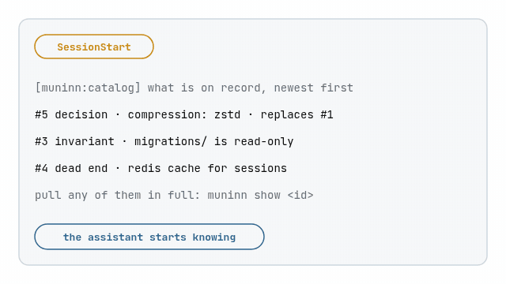
      </picture>
      <b>A new session starts.</b> The assistant knows what is on record before you ask anything.
    </td>
    <td width="50%" valign="top">
      <picture>
        <source media="(prefers-color-scheme: dark)" srcset="assets/motion/deadend-dark.gif">
        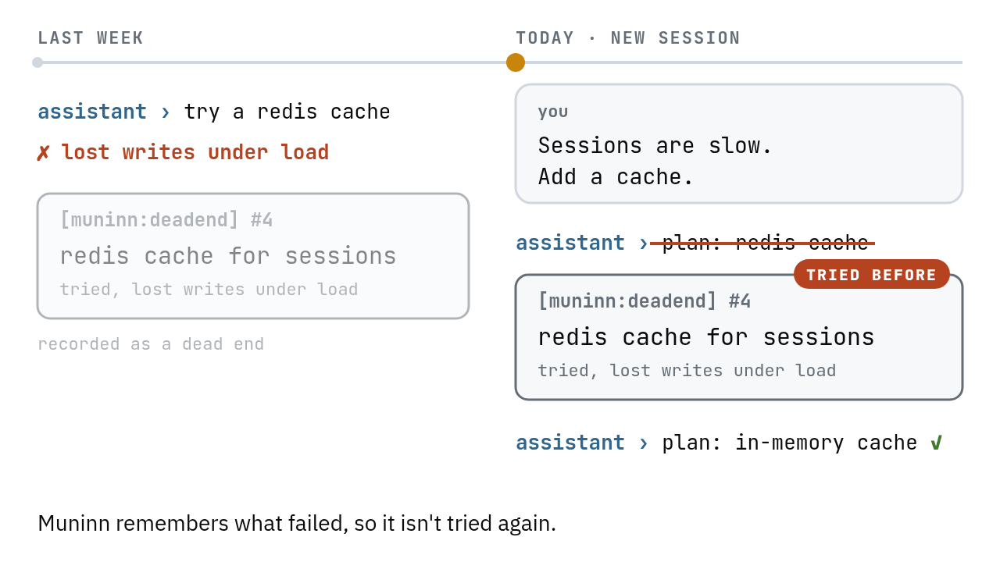
      </picture>
      <b>It is about to repeat a mistake.</b> What failed last time comes back before it is tried again.
    </td>
  </tr>
  <tr>
    <td valign="top">
      <picture>
        <source media="(prefers-color-scheme: dark)" srcset="assets/motion/rule-dark.gif">
        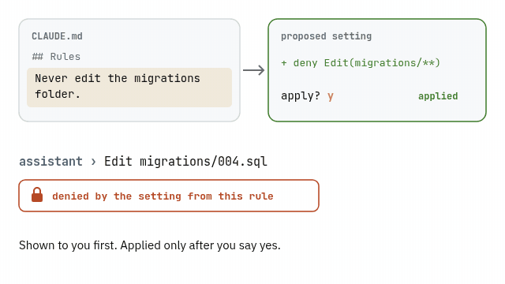
      </picture>
      <b>A written rule becomes a lock.</b> You see the proposed setting first, and it applies only after you say yes.
    </td>
    <td valign="top">
      <picture>
        <source media="(prefers-color-scheme: dark)" srcset="assets/motion/compact-dark.gif">
        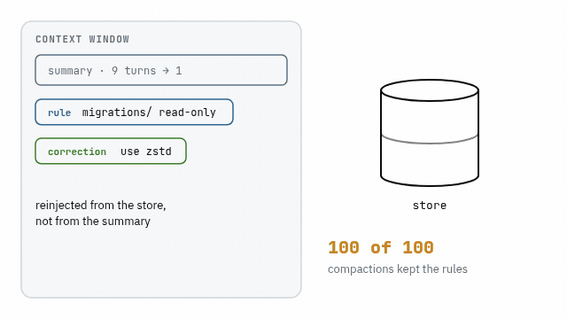
      </picture>
      <b>The conversation gets compacted.</b> Rules come back from the store, not from the summary: 100 of 100 times.
    </td>
  </tr>
  <tr>
    <td valign="top">
      <picture>
        <source media="(prefers-color-scheme: dark)" srcset="assets/motion/commit-dark.gif">
        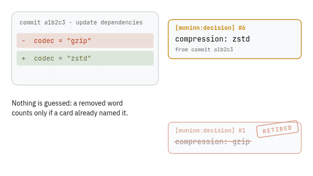
      </picture>
      <b>A commit changes a value.</b> The decision that named the old value is retired on its own.
    </td>
    <td valign="top">
      <picture>
        <source media="(prefers-color-scheme: dark)" srcset="assets/motion/fault-dark.gif">
        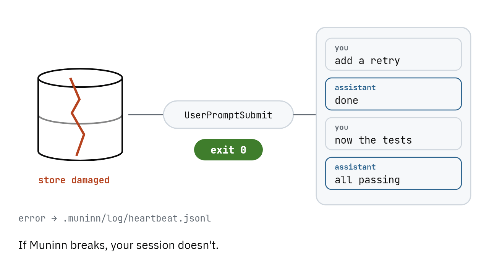
      </picture>
      <b>Muninn breaks.</b> Your session does not. Every hook exits cleanly, and the error goes to a log.
    </td>
  </tr>
</table>

## Rules that block instead of rules that get ignored

Claude Code reads `CLAUDE.md` as context, and a rule in it can be lost when a long conversation
is compacted or simply not followed. Muninn turns a rule such as "never edit the migrations
folder" from `CLAUDE.md`, `AGENTS.md` or `.claude/rules` into Claude Code permission rules and a
deny hook, so the edit is refused before it happens. It shows you the proposed settings first
and changes nothing until you say yes:

```sh
muninn compile && muninn apply
```

In Claude Code, `/muninn:apply` does the same.

<p align="center">
  <picture>
    <source media="(prefers-color-scheme: dark)" srcset="assets/motion/local-dark.gif">
    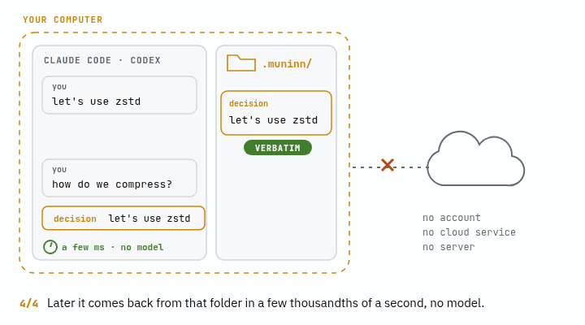
  </picture>
</p>

## Muninn compared with claude-mem and agentmemory

Every row below comes from the same test harness: the same live sessions filled each tool's
memory through its own hooks, and a fixed check graded what the assistant wrote. No AI judge
graded anything.

| | Muninn | claude-mem | agentmemory |
|---|---|---|---|
| Uses the current decision after you changed it in conversation | **252 / 270** | 208 / 268 | not in this run |
| …when the change also reached the code | **54 / 54** | 25 / 54 | 1 / 54 |
| Writes a replaced value into its work anyway | **0 / 54** | 10 / 54 | — |
| Same conversations give the same memory | yes, 3 runs of 20 sessions stored the same records | stored text did not overlap between two runs | not measured |
| Room it takes in the assistant's context | about 2.4 times claude-mem's | baseline | not measured |

Every row above measures the same case: a decision that changed while the project went on.
If you need one memory for a whole team, use an assistant other than Claude Code or Codex, or
already run short on context, read the limits below before you install. Mem0, Zep, Letta and
Claude Code's built-in memory have not been run on the same harness, so there is no figure to
compare. [docs/why-muninn.md](docs/why-muninn.md) says why for each one.

## Limits

- Muninn uses a bit more of the assistant's attention. Assistants can only keep so much text in
  mind at once. Muninn's reminders take about 2.4 to 2.6 times the room claude-mem's do. You can
  switch the per-message reminders off, at the cost of a few more wrong answers.
- It notices a change best when you write a sentence. "Let's switch to zstd" is easy to catch,
  while a reply that is just the word "zstd" is harder, though Muninn now wins that case too.
- Languages don't mix well. If you ask in English about something you decided in Spanish,
  Muninn may not find it.
- It is a personal memory. On a team, each person gets their own, built from their own
  conversations, and a `git push` does not share it with anyone. Muninn keeps its folder out of
  your repository, so your conversations are not published along with your code.
- It works with Claude Code and Codex only, for now. Other assistants are planned for later.

<p align="center">
  <picture>
    <source media="(prefers-color-scheme: dark)" srcset="assets/motion/divider-dark.gif">
    
  </picture>
</p>

## Install

You need Claude Code or Codex. You do not need to know how to program. Installing is done once
per computer; after that, you turn Muninn on in each project where you want memory.

It works on Windows, macOS (Apple silicon and Intel) and Linux. On Windows, Claude Code needs
[Git for Windows](https://git-scm.com/downloads/win) installed, the same thing Claude Code
itself asks for; Codex needs nothing extra.

### Claude Code

Type these two lines in Claude Code, one at a time:

```
/plugin marketplace add ilien-dev/muninn --sparse .claude-plugin plugin
/plugin install muninn@muninn
```

`--sparse` limits the download to the two folders the plugin needs, about 8 MB. Without it,
`/plugin marketplace add ilien-dev/muninn` still works but downloads the whole repository,
benchmark data included.

Restart Claude Code. The first session downloads Muninn itself, about 13 MB, and checks the
download before using it.

### Codex

Run these in a terminal:

```sh
codex plugin marketplace add ilien-dev/muninn --sparse .claude-plugin --sparse plugin
codex plugin add muninn@muninn
```

Open Codex, type `/hooks` and approve Muninn's hooks. Codex runs no plugin hook until you do.
The first session after that downloads Muninn, the same way as in Claude Code.

## Setting up a new project

Muninn stays silent in a project until you turn it on there. Do it once per project, on each
computer you work from: the memory lives on your machine, not in the repository, so a fresh
clone starts without it.

**In Claude Code**, open the project and type:

```
/muninn:init
```

**In Codex** there is no command for this, so you ask Codex to do it. Open Codex in the project
folder, paste this message and send it:

```
Run `muninn init` in this project, then `muninn status`. If `muninn` is not found, use `~/.local/bin/muninn` instead (on Windows, `~/.local/bin/muninn.exe`). Show me what both commands print.
```

Codex may ask your permission before running them; say yes. When it's done, the last line it
shows starts with `MUNINN` and says `GREEN`.

If you prefer the terminal, run this inside the project folder instead:

```sh
~/.local/bin/muninn init
```

On Windows, in PowerShell: `~\.local\bin\muninn.exe init`.

That file appears after your first Codex session with the plugin installed. If it isn't there
yet, open Codex once, close it, and try again.

To check it in Claude Code, type `/muninn:status`: it prints a line starting with `MUNINN` that
says `GREEN`. Memory starts filling from that conversation on. If you use both assistants on the
same project, one `init` covers both.

<p align="center">
  <picture>
    <source media="(prefers-color-scheme: dark)" srcset="assets/motion/install-dark.gif">
    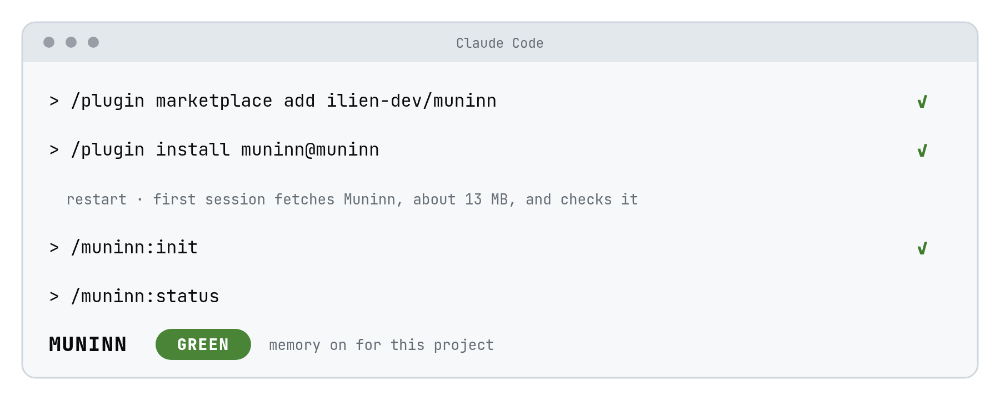
  </picture>
</p>

What `init` changes in the project:

- It creates the `.muninn/` folder, where the memory is kept, and adds it to `.gitignore`, so
  your conversations never end up in a commit.
- It turns off Claude Code's own memory for the project. `muninn init --keep-native` leaves it
  on.
- It lets the assistant run `muninn why`, `muninn status` and `muninn show` without asking you
  each time.

Running it twice is harmless. To remove Muninn from a project, run `muninn clean --yes`: it
undoes exactly what `init` changed.

## Updating

- Claude Code: open `/plugin`, choose the muninn marketplace and update it, or turn on
  auto-update there once.
- Codex: run `codex plugin marketplace upgrade`.

Restart the assistant afterwards. You don't run `muninn init` again: the first session after an
update fetches the new version, and the memory you already have stays.

## Using it

You don't need to do anything. Muninn listens while you work. If you are curious, you can ask it
what it knows:

```sh
muninn why "why did we pick zstd"   # what stands now, and what it replaced
muninn status                        # is everything healthy
```

## Questions

<details>
<summary><b>Why does Claude Code forget everything between sessions?</b></summary>

Each session starts with an empty context: the assistant only knows what is in `CLAUDE.md` and
what you tell it again. Muninn keeps the decisions, rules, corrections and dead ends from earlier
sessions and hands the ones that matter back to the assistant when you write a message, capped at
700 tokens. Codex works the same way, and Muninn covers it with the same memory.
</details>

<details>
<summary><b>Why does Claude ignore my CLAUDE.md, and can Muninn stop it?</b></summary>

`CLAUDE.md` is read as context, not as a setting, so a rule can be dropped when the conversation
is compacted or skipped during a long task. Muninn helps in two ways. Rules come back from its
store after a compaction, not from the summary (100 of 100 times in our test). And a rule you
turn into a setting with `muninn compile && muninn apply` blocks the action whether or not the
assistant remembers it.
</details>

<details>
<summary><b>Does it send my conversations anywhere?</b></summary>

No. There is no account, no server and no cloud service. The memory is a folder called
`.muninn/` inside your project, and `init` adds it to `.gitignore` so it never reaches a commit.
On the first session the plugin downloads Muninn itself and checks it against its checksum
before it runs.
</details>

<details>
<summary><b>Will it slow my assistant down?</b></summary>

Not noticeably. The hooks are held to hard limits in CI with a full store of 20 000 records:
2.8 ms for a session start and 4.0 ms for a message (95th percentile). No AI model runs while it
answers the assistant.
</details>

<details>
<summary><b>What happens if Muninn itself breaks?</b></summary>

Your session carries on. Every hook exits cleanly even when something inside it fails, and the
error goes to a log in `.muninn/log/`. A test drives the real hooks 200 times per run, including
with the database corrupted, and fails if a hook blocks or a retired decision leaks out.
`muninn status` tells you what is wrong.
</details>

<details>
<summary><b>Do I need an API key, or does it cost anything to run?</b></summary>

No key and no running cost. Muninn is a single program on your computer, and it does not call
a paid model.
</details>

<details>
<summary><b>Does it clash with Claude Code's own memory?</b></summary>

`init` turns Claude Code's built-in memory off for that project. If you want to keep both, run
`muninn init --keep-native`.
</details>

<details>
<summary><b>Is it an alternative to claude-mem, Mem0 or engram?</b></summary>

It does the same job as claude-mem: memory across sessions, through hooks, for coding assistants.
The difference is what happens when a decision changes. We tested Muninn against claude-mem and
agentmemory on that case, and the results are [above](#muninn-compared-with-claude-mem-and-agentmemory).
Mem0 and engram have not been run on the same test, so there is no figure to compare yet.
</details>

<details>
<summary><b>Can my team share one memory?</b></summary>

Not yet. Each person's memory is built from their own conversations and stays on their machine.
A `git push` does not share it.
</details>

<details>
<summary><b>How do I see what it remembers, or take it out?</b></summary>

`muninn why "your question"` shows what stands now and what it replaced, and
`muninn why --all "topic"` includes the retired ones. To remove Muninn from a project, run
`muninn clean --yes`, which undoes exactly what `init` changed.
</details>

<p align="center">
  <picture>
    <source media="(prefers-color-scheme: dark)" srcset="assets/motion/divider-dark.gif">
    
  </picture>
</p>

## For the technically curious

- [How Muninn works, and how well](docs/technical-overview.md): the design, every measurement,
  where it is weak, and how to build it from source.
- [Why Muninn](docs/why-muninn.md): the comparison with other memory tools.
- [What we claim and what we don't](docs/claims.md): every result with its limits.
- [What Muninn deliberately leaves out](docs/scope.md).
- [Changes between versions](CHANGELOG.md).

## About the name

<picture>
  <source media="(prefers-color-scheme: dark)" srcset="assets/motion/eye-dark.gif">
  
</picture>

In Norse myth, the god Odin keeps two ravens. Every morning they fly out over the world, and every
evening they come back to tell him what they saw. Huginn is thought; Muninn is memory. In one of
the old poems, Odin says he worries that Huginn may not come back, and that he worries more for
Muninn.

That always struck me as the right way round: a thought can be had again, and a memory that does
not come back is gone.

Your AI assistant is Huginn. It thinks fast, it covers a lot of ground, and every morning it
starts from nothing. Muninn is the one that comes back carrying what you decided.

## License

Muninn is © 2026 ilien and free to use under the
[GNU Affero General Public License, version 3 only](LICENSE), with the extra terms in
[`NOTICE`](NOTICE). In short:

- Anyone may use, change, host and sell Muninn, including as a cloud service.
- Anyone who shares a changed version, or offers one to people over a network, must publish its
  full source code under the same license.
- Every copy must keep the notice "Based on Muninn by ilien - https://github.com/ilien-dev/muninn",
  and a changed version must say it was changed.

Want to contribute? There is a one-time [Contributor License Agreement](CLA.md); see
[CONTRIBUTING.md](CONTRIBUTING.md).

The animations in this README are drawn from [`assets/motion/source/`](assets/motion/source/)
and can be rebuilt with `node export.mjs` there.
